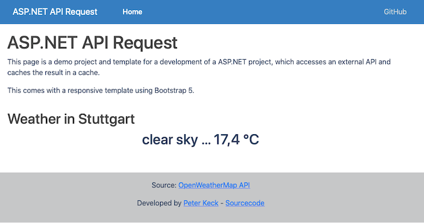

<h1 align="center">Welcome to ASP.NET-api-request 👋</h1>
<p>
  
  <a href="https://github.com/pyrrolizin/dotnet-api-request/blob/master/LICENSE" target="_blank">
    
  </a>
</p>


>This project is a starting platform for a ASP.NET project that pulls data from an external API and caches the result.
>The project includes a responsive Bootstrap 5 template.

## 🏠 [Homepage](https://github.com/pyrrolizin/aspnet-api-request)

## ✨ Demo (OpenWeatherMap-Api - Current weather in Stuttgart, Germany)

tbd



## Prerequisit

* DOT.NET >= 6.0

## Install

```sh
dotnet restore
```

### Environment varaibles

You can set the following environment variables:

| NAME        |  *required*  |  Comment  |
| ----------- | ------------ | --------- |
| `API_KEY`   | **yes**      |  You can get your own free OpenWeatherApi key on this website: https://home.openweathermap.org/users/sign_up  |

You can either set the environment variables or use the `.env` file:
Make your own copy of the `.env` file and specify the `.env` and add the keys.

```sh
cp ./.env_default ./.env
```

Learn more about the OpenWeatherMap API: https://openweathermap.org/api

## Getting Started

First, run the development server:

```bash
dotnet run
```

Open [http://localhost:5037](http://localhost:5037) with your browser to see the result.

### Hot reload

To run the Server with hot reload use:

```bash
dotnet watch run
```
